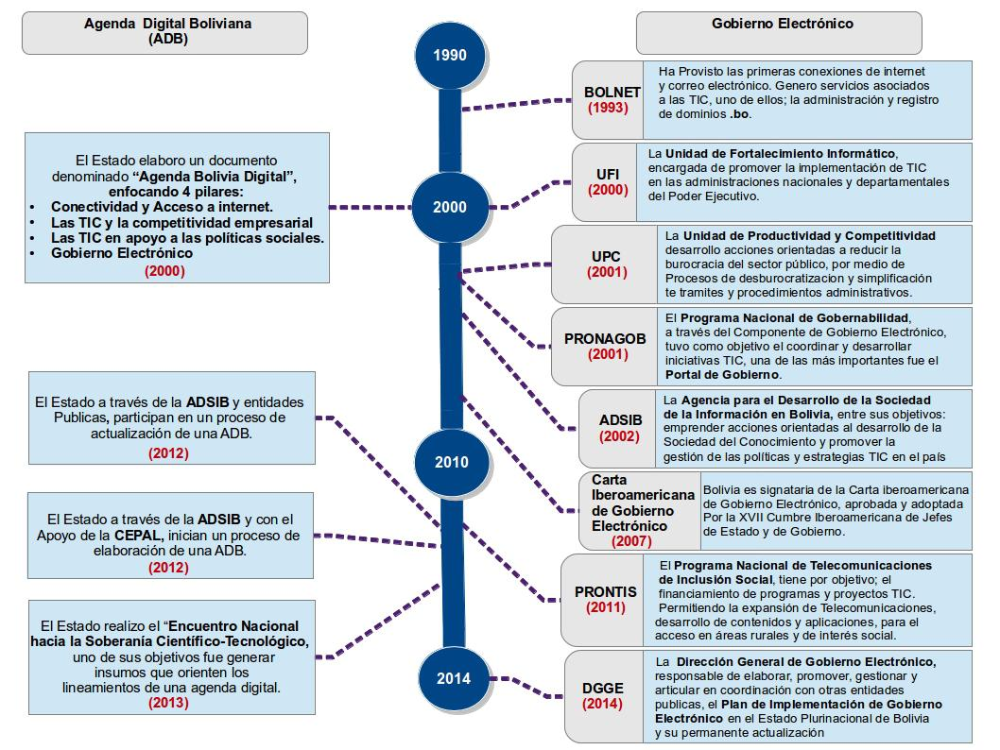
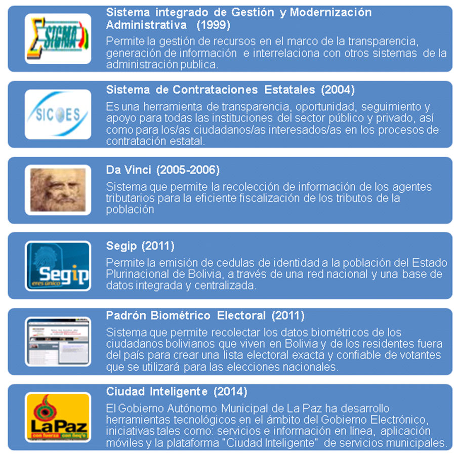

# Antecedentes

## Agenda digital y Gobierno Electrónico en Bolivia

El Estado boliviano ha avanzado en la formulación de diversas propuestas de una Agenda Digital Boliviana (ADB), con el objetivo de enmarcar políticas públicas,  para la adopción de TIC que permitan establecer estrategias y acciones tecnológicas orientadas acortar la brecha digital y avanzar hacia una sociedad de la información y del conocimiento en el país. A lo largo de  los últimos años las instituciones públicas han impulsado el Gobierno Electrónico, a través del desarrollado e incorporado de iniciativas TIC, pero de manera aislada, sin una estrategia tecnológica que oriente el proceso de transformación en la gestión pública y la  población.
Actualmente se cuenta con una política de Estado que promueve la incorporación del Gobierno Electrónico, con el objetivo de modernizar y transparentar la gestión pública y otorgar servicios y atención de calidad a la ciudadanía, por medio de mecanismos y condiciones tecnológicas que garantizará el aprovechamiento de las TIC.
El siguiente esquema muestra la evolución de una Agenda Digital y el Gobierno Electrónico en Bolivia:

## Iniciativas desarrolladas

Existen avances en el desarrollo de herramientas transversales de Gobierno Electrónico en algunas entidades del Estado que fueron diseñadas en función a las necesidades del Gobierno. Las más importantes son:

## Marco Normativo Vigente

El marco normativo vigente define las bases para la implementación del Gobierno Electrónico. El mismo, está compuesto por cuatro bloques legales; la CPE, los planes y estrategias nacionales, la normativa relacionada con las TIC, y otras normativas vinculadas con aspectos relevantes al Plan. A continuación se detallan las principales: 

* BLOQUE: I.  CONSTITUCIONAL
	* NORMA: Constitución Política del Estado (CPE)
		* DESCRIPCIÓN: Establece el derecho al acceso universal y equitativo a las telecomunicaciones; por otro lado, estipula que el Estado asumirá como política la implementación de estrategias para incorporar el conocimiento y aplicación de las TIC.
* BLOQUE: II.  LEY Y DECRETO TIC
	* NORMA: Ley 164
		* DESCRIPCIÓN: Determina que es prioridad nacional la promoción, acceso, uso y apropiación de las TIC para procurar el vivir bien de todas las bolivianas y bolivianos, especialmente para aquellos con menores ingresos y con necesidades especiales. 
	* NORMA: DS 1793
		* DESCRIPCIÓN: Esta norma está orientada a modernizar y transparentar la gestión pública, otorgando servicios y atención de calidad a la ciudadanía, garantizando el derecho a la información, así como contribuir a la eficiencia y eficacia de los actos administrativos del gobierno, mediante el uso de las TIC y otras herramientas. Buscando generar mecanismos tecnológicos de participación y control social por parte de los ciudadanos, organizaciones sociales y pueblos y naciones indígena originario campesinos. 
* BLOQUE: III.  PLANES
	* NORMA: Agenda Patriótica
		* DESCRIPCIÓN: Tres de sus 13 pilares están relacionados con soberanía tecnológica, transparencia y servicios públicos
	* NORMA: Plan Nacional de Desarrollo
		* DESCRIPCIÓN: El Plan debe enmarcarse en se enmarca en el pilar Bolivia Productiva dentro la Política De Innovación y Desarrollo Tecnológico.
* BLOQUE: IV.  OTRA NORMATIVA IMPORTANTE
	* NORMA: Ley 1178 “Administración y Control Gubernamental”
		* DESCRIPCIÓN: Regula los sistemas de Administración y de Control de los recursos del Estado y su relación con los sistemas nacionales de Planificación e Inversión Pública
	*NORMA: Ley 2341 “Ley de Procedimiento Administrativo”
		* DESCRIPCIÓN: Es la norma que regula la actividad administrativa y el procedimiento administrativo del sector público; Hace efectivo el ejercicio del derecho de petición ante la Administración Pública; regula la impugnación de actuaciones administrativas que afecten derechos subjetivos o intereses legítimos de los administrados
	* NORMA: Ley Nº 004  “Ley de Lucha Contra la Corrupción, Enriquecimiento Ilícito e Investigación de Fortunas “Marcelo Quiroga Santa Cruz”
		* DESCRIPCIÓN: Establece mecanismos, y procedimientos destinados a prevenir, investigar, procesar y sancionar actos de corrupción cometidos por servidores públicos y ex servidores públicos, en el ejercicio de sus funciones, y personas naturales o jurídicas que comprometan o afecten recursos del Estado, así como recuperar el patrimonio afectado del Estado a través de los órganos jurisdiccionales competentes.
	* NORMA: Ley N° 341“Ley de Participación y Control Social”
		* DESCRIPCIÓN: Fortalece la democracia participativa, representativa y comunitaria, basada en el principio de soberanía popular. Consolidando la Participación y Control Social en la gestión pública; y en los procesos de planificación, seguimiento a la ejecución y evaluación de las políticas públicas y las acciones, en todos sus ámbitos y niveles territoriales. Transparenta la gestión pública y el apropiado manejo de los recursos públicos del Estado. Garantizando y promoviendo la Participación y Control Social en la provisión y calidad de los servicios públicos.
	* NORMA: Decreto Supremo N° 27329“Transparencia y Acceso a la Información”
		* DESCRIPCIÓN: Procura la transparencia y acceso a la información gubernamental.
	* NORMA: Decreto Supremo N° 27330“Simplificación de Trámites”
		* DESCRIPCIÓN: Declara como prioridad nacional e interés público la Simplificación de Trámites, con la finalidad de agilizar, optimizar tiempos y reducir costos de los mismos.

## Situación actual y perspectivas de tecnologías/facilitadores de GE

(por definir)
