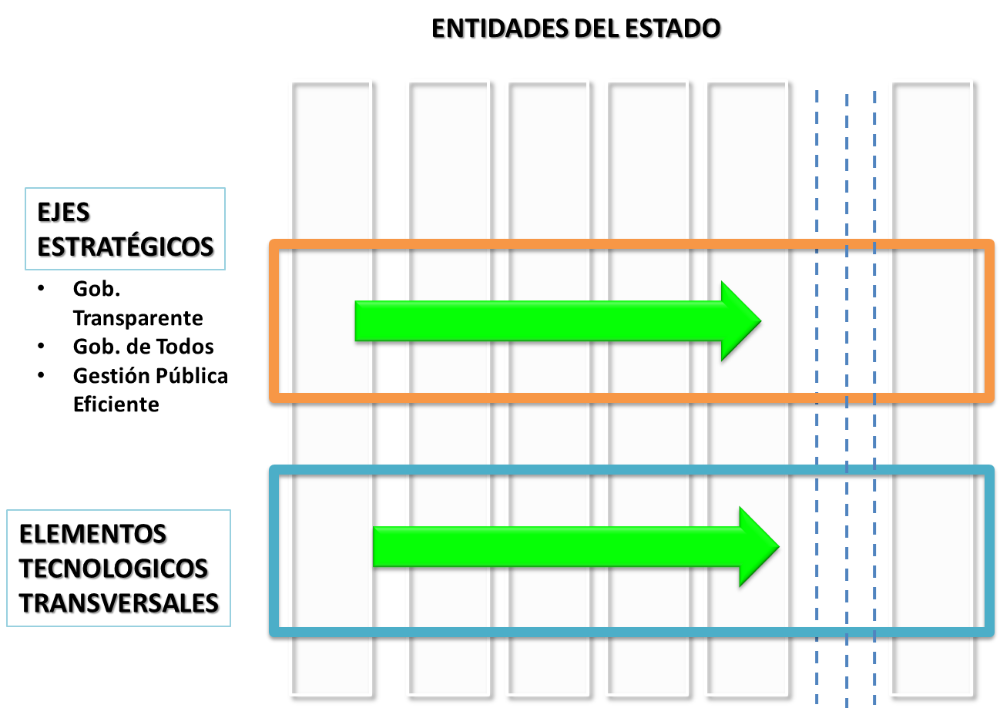

# COMPONENTES

Los componentes del plan de gobierno electrónico están compuestos por Ejes Estratégicos y Elementos Transversales.

* [A. Ejes estratégicos](partes/ejes_estrategicos.md)
* [B. Elementos transversales](partes/elementos_transversales.md)
