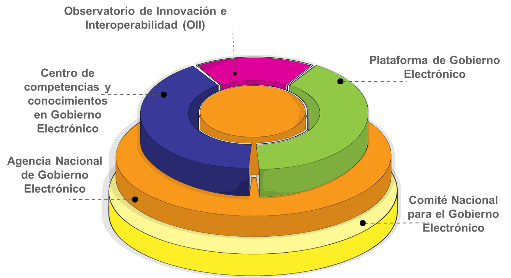

# A. ESTRUCTURA INSTITUCIONAL

* Lineamiento: El Estado deberá establecer una estructura institucional adecuada para promover la implementación del gobierno electrónico de manera sistemática y de manera eficiente a nivel del Estado
	* Descripción
		* Acciones: Establecimiento de una ley que establezca la estructura institucional que dirigirá la implementación   del gobierno electrónico en el Estado.
			* Normativa actual: Ley 164
			* Normativa futura: Nueva Ley para la creación de la Agencia Nacional de Gobierno Electrónico

A nivel estratégico la estructura institucional está compuesta por: 

## 1. Comité Nacional para el Gobierno Electrónico

El Comité Nacional de Gobierno Electrónico será un ente conformado por varias entidades del sector TIC que tendrá la tarea de definir la visión de país en cuanto al gobierno electrónico, definir la agenda de implementación de proyectos estratégicos de gobierno electrónico y determinar metas para la implementación del gobierno electrónico.

## 2. Agencia Nacional de Gobierno Electrónico

La Agencia Nacional de Gobierno Electrónico  va a desarrollar cuatro roles:

1. Rol Evaluación: Estimar y monitorear los indicadores de avance del Plan de Implementación, la adherencia de las entidades del Estado al Plan, y evaluar el impacto de las iniciativas implementadas. 
2. Rol Gestión: Administrar la Plataforma de Gobierno Electrónico, el Observatorio de Innovación e Interoperabilidad y el Centro de competencias y conocimientos en Gobierno Electrónico.
3. Rol normativo: Desarrollo de normas y reglamentos legales que viabilicen  la implementación del Gobierno Electrónico.
4. Rol Interoperabilidad: Desarrollar de marcos e instrumentos para la Interoperabilidad, el intercambio de información entre las entidades del Estado y el establecimiento de estándares técnicos. 

A nivel operativo la Agencia de Gobierno Electrónico estará compuesta por: 

### 2.1 Plataforma de Gobierno Electrónico

La plataforma de Gobierno Electrónico estará enfocada a la coordinación de iniciativas de gobierno electrónico en las entidades públicas, el desarrollo de servicios y aplicaciones comunes y transversales al Estado (por ejemplo, un sistema único de gestión documental para todas las entidades del Estado) y el desarrollo de proyectos estratégicos de gobierno electrónico (una plataforma de trámites para todo el Estado). A través de esto, se  garantizará que se puedan detectar iniciativas similares en entidades del Estado, evitando así la duplicidad de esfuerzos.

Objetivo: Desarrollo de iniciativas, herramientas y servicios de gobierno electrónico en el Estado

* Lineamiento: Las iniciativas, herramientas o servicios e gobierno electrónico que emprendan o desarrollen las entidades del Estado deberán ser coordinados con la Plataforma de Gobierno Electrónico.
	* Descripción: Con el propósito de orientar el desarrollo de herramientas de Gobierno electrónico en el Estado, todas las iniciativas a desarrollar serán coordinadas por la plataforma de Gobierno electrónico.
	En una etapa inicial los proyectos serán mayormente impulsados por la Plataforma de Gobierno electrónico para luego ser traspasados a las entidades pertinentes para que sean asumidos.
		* Acciones
			* Normativa Actual
			* Normativa Futura
* Lineamiento: El Estado creará un fondo de innovación para financiar iniciativas de gobierno electrónico que emprendan las entidades públicas. 
	* Descripción: Mediante este fondo, el Estado financiará iniciativas en Gobierno electrónico que las diferentes entidades del Estado concursen según sus necesidades y fines institucionales. La Plataforma de Gobierno Electrónico será el ente encargado de asignar los recursos del mismo según la pertinencia e importancia de la herramienta de gobierno electrónico en cuestión
		* Acciones: Definir lineamientos para el concurso de las entidades públicas a los fondos de innovación en gobierno electrónico.
			* Normativa Actual
			* Normativa Futura

### 2.2 Observatorio de Innovación e Interoperabilidad (OII)

El observatorio de Innovación e Interoperabilidad tendrá los siguientes roles:

1. Rol regulación de intercambio de información: En el siguiente esquema se muestra el rol que tendrá el Observatorio en como regulador del intercambio de información. 

2. Rol promoción de la innovación: Será la entidad responsable de desarrollar investigación aplicada en TIC y de promover la innovación e investigación de las TIC en las entidades públicas para impulsar la competitividad en el sector público.
3. Rol coordinación/centralización de información estatal: Será la entidad responsable de identificar  y analizar la información que sea del interés y utilidad para otras entidades públicas, con el propósito de facilitar un mayor intercambio y coordinación de información entre entidades públicas. Asimismo, deberá identificar información de entidades públicas que deba ser accesible para el ciudadano. Finalmente,  definirá criterios estándar de intercambio de información, y centralizará y gestionará las solicitudes de intercambio de información entre entidades del Estado.
4. Rol elaboración y actualización de estándares técnicos. El observatorio tendrá a su tuición el desarrollo y actualización de estándares técnicos para garantizar que el Estado cuente con lineamientos técnicos actualizados que permiten implementar el gobierno electrónico. 
5. Rol de soporte y consultoría técnica a entidades públicas. El Observatorio realizará el acompañamiento, soporte y asesoría técnica a las entidades del Estado en el desarrollo de herramientas y servicios de gobierno electrónico. 

### 1.3 Centro de competencias y conocimientos en Gobierno Electrónico 

Con el propósito de apoyar el desarrollo de iniciativas de Gobierno Electrónico, Centro de competencias y conocimientos en Gobierno Electrónico estará orientado a proveer los siguientes roles:

1. Rol de formación y capacitación: Formación y capacitación en TIC y Gobierno Electrónico a la población y a los servidores públicos. Esto involucra el desarrollo de materiales y contenidos de capacitación y formación, tales como guías y manuales.
2. Rol de apropiación en la sociedad: Desarrollar iniciativas de difusión y socialización de los beneficios y ventajas del Gobierno Electrónico. A la vez, desarrollo de iniciativas y estrategias de gestión del cambio, apropiación ciudadana e inclusión y cierre de la brecha digital. Esto involucra el monitoreo de acceso y uso de TIC y Gobierno Electrónico en la sociedad.
3. Rol de gestión de conocimiento: Gestión de conocimiento sobre gobierno electrónico, sistematización de buenas prácticas y la participación y coordinación de cooperación internacional y alianzas estratégicas.
4. Rol de gestión y administración de las comunidades y redes de práctica.
