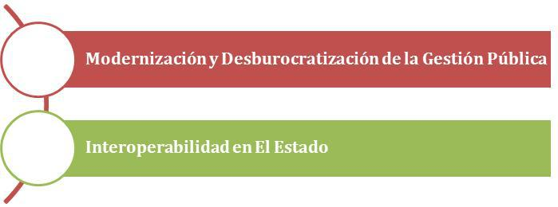

# GESTIÓN PÚBLICA EFICIENTE

## ANTECEDENTES

Existe la percepción en la ciudadanía de que los servicios y los procedimientos que existen en el Estado son, en su mayoría, poco ágiles. La sociedad ha impulsado mejoras en los sistemas y procedimientos internos de algunas entidades que han repercutido en mejores servicios a la población. No obstante, en gran parte del Estado persisten problemas de eficiencia que hacen de la gestión pública; burocrática.  Esto se debe en buena medida, a las limitadas iniciativas y la baja integración de las TIC en la gestión pública actual. 

El desconocimiento de los beneficios de las TIC en la administración pública, el conformismo con los procedimientos vigentes, el temor en algunos funcionarios por ser desplazados por la tecnología, la poca iniciativa en el uso de herramientas tecnológicas, son todos factores que han obstaculizado la inclusión tecnológica en nuestro Estado. 

Asimismo, la mayoría de las instituciones públicas actualmente prescinden de plataformas de interoperabilidad, que permitan comunicar los sistemas del Estado entre si y promover la modernización en la gestión pública. La ausencia de procesos de interoperabilidad referente a la información, es una de las múltiples razones; por la que las entidades públicas trabajan el tema de la interoperabilidad de manera aislada e incomunicadas del resto de las entidades del Estado que las pueden requerir. 

**Recuadro: Modelo del proceso de gestión de viáticos en la gestión pública actual**

El siguiente modelo muestra en **términos operativos generales**, un proceso para la emisión de pasajes y gestión de viáticos en la administración pública. El desarrollo del procedimiento mencionado no es ágil y en la mayoría de los casos es manual, no contando con una dinámica tecnológica y colaborativa entre las instancias internas correspondientes. El actual método procedimental se antepone a la **modernización de la gestión pública** en el Estado Plurinacional de Bolivia.

**Objetivo Eje Gestión Publica Eficiente**: El Estado Plurinacional de Bolivia adopta, aplica y aprovecha al máximo la inclusión de las TIC que favorece y mejora la producción de los procesos internos administrativos y por consiguiente la prestación a la sociedad, buenas prácticas y un ámbito colaborativo en la administración pública.

## A. MODERNIZACIÓN Y DESBUROCRATIZACIÓN DE LA GESTIÓN PÚBLICA 

**Objetivo**: Simplificar los procesos administrativos del Estado como requisito para mejorar la eficiencia interna y los servicios otorgados por las entidades públicas.

* Líneas de acción: El Estado deberá implementar un programa de Simplificación Administrativa 
	* Descripción:
		* Este programa pretende establecer procesos ágiles y sencillos orientados a mejorar la eficiencia y eficacia de la administración pública, generando procedimientos equitativos y expeditos.
		* Su implementación deberá orientarse a los tres (3) niveles de Estado. 
	* Acciones
		* Elaborar el programa de Simplificación Administrativa
		* Realizar un acompañamiento a las entidades en sus procesos internos de simplificación administrativa.
		* Coordinar estrategias de inclusión de Gobierno electrónico con los sectores de Educación, Salud y Productivo.
	* Normativa
		* Actual:
			* Ley 1178 “Administración y Control Gubernamental”
			* Ley 2341 “Ley de Procedimiento Administrativo”
			* Decreto Supremo N° 27330 “Simplificación de Trámites”
		* Futura
			* Revisar Normativa vigente para proyectar una adecuación y modernización de la misma.

### a) Automatización de procesos 

Es necesario reorientar las prioridades de las instituciones de gobierno hacia estrategias de  identificación y priorización de la automatización de procesos de la administración gubernamental. 

**Objetivo**: Automatización de los procesos y procedimientos de la gestión pública para mejorar la eficiencia en la administración y  la prestación de los servicios de las entidades públicas.

* Líneas de acción: Las entidades del Estado deberán automatizar sus procesos y procedimientos internos.
	* Descripción: Las instituciones públicas automatizarán los procesos administrativos internos (procesos de trabajo cotidiano) y externos (prestación de servicios a la población), haciendo uso intensivo de TIC.
	* Acciones:
		* Las entidades deben realizar  diagnósticos de servicios y tramites (tramites: críticos,  accesibilidad, manuales, automáticos o mixtos)
		* Análisis, identificación y automatización de procesos.
	* Normativa
		* Actual:
			* Ley 1178 “Administración y Control Gubernamental”
			* Ley 2341 “Ley de Procedimiento Administrativo”
		* Futura: Analizar la Normativa vigente para proyectar una adecuación y modernización de la misma

### b) Incorporación de prácticas eficientes a través de medios digitales 

Existen herramientas y prácticas que harán posible el incremento en la eficiencia de los procesos del Estado, a través de medios digitales. Esto permitirá ahorros de recursos, espacio físico, seguridad y tiempos, y el mejoramiento de procesos cotidianos en la administración pública. 

**Objetivo**: Incorporar herramientas y mecanismos tecnológicos en las entidades públicas orientadas a una mayor eficiencia en la gestión publica 

* Líneas de acción: Las entidades del Estado deberán priorizar la utilización o reutilización  de sistemas de gestión pública únicos y transversales al Estado.
	* Descripción: Las entidades del Estado priorizaran la utilización de sistemas únicos y transversales al Estado. Es decir, para evitar la duplicidad de esfuerzos y recursos, deberán reutilizar los sistemas de gestión pública existentes o desarrollados por otras entidades.
	* Acciones
		* El Estado deberá catalogar sus sistemas de administración y gestión pública.
		* El Estado deberá orientar y coordinar la implementación de sistemas que son de uso común y transversal entre entidades públicas. 
	* Normativa
		* Actual: D.S. 1793
		* Futura: Acuerdo de constitución y operación del Observatorio de Gobierno Electrónico
* Líneas de acción: El Estado creará una red de práctica entre sus servidores públicos a través del portal, para compartir buenas prácticas de eficiencia en la administración pública. 
	* Descripción: Todos los servidores públicos serán parte de una red gubernamental virtual para interacción, colaboración y cohesión según áreas de expertise. 
	* Acciones:
		* Conformación de la red de servidores públicos y los mecanismos de trabajo.
		* Desarrollo de contenidos informativos y de formación para la eficiencia pública.
		* Desarrollar iniciativas de fomento a la participación en la red de servidores públicos. 
	* Normativa
		* Actual: D.S. 1793
		* Futura: Acuerdo de constitución de la Comunidad de Servidores Públicos
* Líneas de acción: Las entidades del Estado priorizarán el uso de documentos digitales en reemplazo del papel 
	* Descripción: En búsqueda de una mayor eficiencia en la gestión documental de información de las entidades del Estado, se pretende incorporar la práctica de digitalización de documentos en papel.
	* Acciones:
		* Elaborar una guía que oriente a las entidades sobre el uso racional del papel y su reemplazo por medios digitales.
		* Desarrollar iniciativas de fomento al reemplazo u optimización del uso del papel en las entidades públicas. 
	* Normativa
		* Actual: D.S. 1793
		* Futura: Normativa referida al manejo y uso de documentos electrónicos

## B. INTEROPERABILIDAD EN EL ESTADO

El Estado Plurinacional de Bolivia utilizará la interoperabilidad como herramienta principal transversal que posibilitará que los sistemas de diversa plataforma y sus procesos, se comuniquen entre sí, de forma colaborativa, intercambiando datos e información. Esto generará una sólida base tecnológica para la implementación de trámites y servicios en línea. 

**Objetivo**: Garantizar el uso eficiente de los recursos del Estado a través del intercambio de información y la interoperabilidad de sus sistemas

* Líneas de acción: El Estado deberá elaborar e implementar políticas generales de Interoperabilidad para la integración de la información entre instituciones.
	* Descripción: A través de estas políticas las entidades del Estado podrán transferir y utilizar información de manera uniforme y eficiente entre sí. Estas estarán referidas a la adopción preferencial de software libre y estándares abiertos, entre otros temas. 
	* Acciones:
		* Definir políticas generales internacionales de interoperabilidad aplicables a las entidades del Estado.
		* Difundir con las entidades públicas, las políticas generales de interoperabilidad a adoptar en el Estado.
	* Normativa
		* Actual: No existente
		* Futura: Se requiere normativa.

* Líneas de acción: Las entidades públicas deberán adoptar y adaptar normas y estándares técnicos internacionales.
	* Descripción: Estos estándares técnicos están referidos a infraestructura, seguridad informática, interoperabilidad, basados en ePING (Estándares de Interoperabilidad de Gobierno Electrónico)
	* Acciones:
		* Capacitar a las unidades TIC del Estado en normas y estándares de interoperabilidad sobre infraestructura, seguridad informática, interoperabilidad.
		* Brindar asesoramiento a las entidades en la adopción de estándares internacionales en infraestructura, seguridad informática, interoperabilidad.
		* Realización de auditorías informáticas y seguimiento a la implementación de los estándares de interoperabilidad en el Estado.
	* Normativa
		* Actual: No existente
		* Futura: Se requiere normativa.

* Líneas de acción: El Estado, a través del Observatorio de Innovación e Interoperabilidad, coordinará y regulará la efectivización del intercambio de información entre entidades.
	* Descripción: Para asegurar la efectiva interoperabilidad de las entidades públicas, el Estado administrará y centralizará la integración de sistemas e intercambio de información, incluyendo el monitoreo y la evaluación de estos procesos. 
	* Acciones:
		* Definir estándares para el desarrollo de nuevos sistemas y sus interfaces
		* Identificar y catalogar la información existente en las diferentes entidades públicas con miras a su intercambio. 
		* Catalogar los sistemas existentes en las diferentes entidades públicas con miras a su interoperabilidad.
	* Normativa
		* Actual: No existente
		* Futura: Se requiere normativa.
