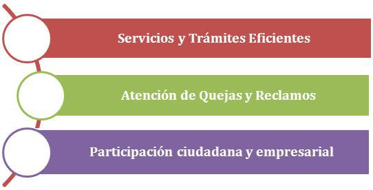

# GOBIERNO DE TODOS

## ANTECEDENTES

El Estado realiza varios esfuerzos para mejorar gradualmente los servicios que brinda a la población. Sin embargo la relación existente hacia la ciudadanía y empresa no es estrecha aún, aspecto que se evidencia en la provisión de servicios al público. El ciudadano se enfrenta a un aparato público complejo y distante en el que las respuestas a sus inquietudes se dan en tiempos prolongados. De forma específica, los servicios que brinda el Estado se componen de trámites largos, confusos y en muchos casos, obsoletos que generan inconformidad. No existe una práctica del reclamo debido a que no existen mecanismos de resarcimiento en caso de daños o perjuicios, o bien no existe respuesta alguna a quien presenta la queja. En cuanto a la participación de la población en procesos de planificación de planificación y toma de decisiones en el ámbito de la democracia no se han generado iniciativas por medios que aprovechen la tecnología. Finalmente esta misma realidad se replica el ámbito de la grande, mediana o pequeña empresa, actores con los que el Estado también mantiene activa interrelación.

Una de las iniciativas recientes que pretende facilitar la realización de trámites es el caso de la implementación de Ventanillas Únicas en diferentes ámbitos. Por ejemplo el Ministerio de Desarrollo Productivo y Economía Plural elaboró proyectos de ventanillas únicas enfocadas a diferentes sectores -como exportación y creación de unidades económicas-, con la finalidad de integrar a las entidades involucradas en la prestación de los servicios para que el ciudadano o la empresa puedan optimizar tiempos y recursos en un solo punto de atención.

En este sentido, es preciso reforzar y desarrollar nuevos mecanismos de acercamiento a la población, a través del uso de las TIC para dar respuestas más rápidas y precisas en los servicios estatales dirigidos al ciudadano y empresa. Los canales de comunicación por medio del internet y de la telefonía móvil son medios que permiten una mayor cobertura e interacción, la utilización de los mismos sin duda darán un giro favorable a la imagen que tiene el Estado hacia la población.

## Objetivo estratégico

El Plan de Gobierno Electrónico define una estrategia de Gobierno de Todos basada en el intensivo y masivo uso de las TIC para mejorar la relación Estado – ciudadanía y empresa. Las áreas que desarrollan temáticas y acciones en este marco y pretenden la promoción de un cambio de paradigma que genere un Estado orientado a la población son: 1) Servicios y Trámites Eficientes, 2) Atención de quejas y reclamos y 3) Participación ciudadana y empresarial. 

# A. SERVICIOS Y TRÁMITES EFICIENTES

**Objetivo**: Desarrollar una relación cercana a la ciudadanía y a la empresa por medio de servicios y trámites eficientes basados en herramientas TIC:

* Lineamientos: Las entidades del Estado deberán modernizar y automatizar sus servicios y publicarlos en la web, los mismos que serán integrados al portal **“Bolivia Cercana”**.
	* Descripción: A través del Portal **“Bolivia Cercana”** la población tendrá acceso a los enlaces de los servicios brindados por las entidades, además de toda la información necesaria para realizar trámites.
	* Actividades:
		* Impulsar a las entidades del estado al desarrollo de servicios y trámites en línea.
		* Construir el Portal “Bolivia cercana” 
		* Desarrollo, administración, publicación y actualización de un Catálogo de Servicios en línea en el portal.
		* Publicación de información sobre  Ventanillas Únicas a través del Portal “Bolivia Cercana”.
	* Normativa:
		* Relacionada: Inexistente
		* Aspectos a considerarse: Se requiere reglamentación participación por medios electrónicos

* Lineamientos: Las entidades del Estado deberán avanzar en el desarrollo de herramientas para atención más ágil al ciudadano y a la empresa.
	* Descripción: Mediante el programa de iniciativas el Estado promoverá a las entidades a la modernización de servicios dirigidos al público con el apoyo de herramientas TIC.
	* Acciones:
		* Coordinar el lanzamiento de Fondos en Concurso relacionados a iniciativas que faciliten la interacción con la población por medios digitales.
		* Impulsar el desarrollo de ventanillas únicas en sectores del Estado que requieren de estos servicios.
	* Normativa:
		* Relacionada: Inexistente
		* Aspectos a considerarse: Se requiere reglamentación participación por medios electrónicos

# B. ATENCIÓN DE QUEJAS Y RECLAMOS

**Objetivo**: Impulsar a las entidades públicas a brindar una respuesta efectiva y oportuna a las quejas de la ciudadanía y la empresa respecto a los servicios de las entidades públicas.

* Lineamientos: Las entidades públicas deberán integrar la **atención de quejas y reclamos** a través de medios digitales como práctica habitual para mejorar la respuesta a la población.
	* Descripción: Las entidades recibirán asesoramiento para implementar herramientas digitales con el fin de atender y dar seguimiento a las quejas y reclamos de los servicios que brindan.
	* Actividades:
		* Asesorar en el desarrollo de mecanismos (Ej. Portales web, líneas gratuitas de atención a la población, entre otros) para atender quejas a nivel de cada entidad del Estado.
		* Brindar lineamientos de atención al público por medios digitales.
		* Desarrollar iniciativas para monitorear las respuestas de las entidades. (Ej. Foros y Redes de Opinión)
	* Normativa
		* Relacionada: Inexistente
		* Aspectos a considerarse: Se requiere reglamentación relacionada a participación por medios electrónicos

# C. PARTICIPACIÓN CIUDADANA Y EMPRESARIAL

**Objetivo**: Fomentar la participación activa del ciudadano y la empresa en temas de interés en su relación con el Estado.

* Lineamientos: Las entidades públicas deberán generar espacios para la participación ciudadana y empresarial a través del uso de TIC.
	* Descripción: El Estado apoyará y realizará seguimiento a las entidades para que puedan implementar herramientas tecnológicas de participación ciudadana de acuerdo a los servicios que brindan.
	* Actividades:
		* Identificar el tipo de servicios que brindan las entidades en directa interacción con el ciudadano y la empresa.
		* Asesorar y acompañar a las entidades en el desarrollo e implementación de mecanismos tecnológicos para la participación con la población.
	* Normativa
		* Relacionada: Ley 341 , Ley de Participación y Control Social
		* Aspectos a considerarse:

* Lineamientos: El Estado generará espacios para la participación ciudadana y empresarial a través del uso de TIC.
	* Descripción: Según diferentes temáticas de interés público definidas por el Estado, se desarrollarán mecanismos en los que la población podrá exponer sus inquietudes y demandas.
	* Actividades
		* Recoger demandas de la ciudadanía y la empresa en áreas estratégicas (salud, educación y desarrollo productivo) y fomentar la participación deliberativa en medios digitales.
		* Identificar, desarrollar y aplicar herramientas TIC para el fomento de la participación individual y grupal  sobre temáticas relacionadas planificación y toma de decisiones del Estado reforzando la democracia. 
		* Impulsar la participación en línea y reforzar la democracia a través del Portal “Bolivia Cercana”.
		* Identificar gestores de comunidades sociales en línea y generar redes virtuales.
	* Normativa
		* Relacionada: Ley 341 , Ley de Participación y Control Social
		* Aspectos a considerarse: 

