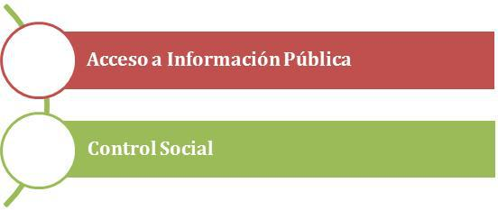

# GOBIERNO TRANSPARENTE

GOBIERNO TRANSPARENTE

## ANTECEDENTES

El Estado Plurinacional de Bolivia ha avanzado en la implementación de la Política Nacional de Transparencia y Lucha Contra la Corrupción con el fin de mantener a la población informada de forma permanente sobre las acciones de la gestión pública buscando garantizar el acceso a la información y promoviendo la participación activa para generar mayores niveles de confianza. Se realza el impulso que ha dado el Ministerio de Transparencia Institucional y Lucha contra la Corrupción (MTILC) como entidad cabeza de sector en el establecimiento de varios mecanismos de difusión de información de interés público a través de medios de comunicación masiva, medios impresos, audiovisuales, radiales y electrónicos y además el desarrollo de audiencias de rendición de cuentas dirigidas a la población. 
En cuanto a publicación de información por medios electrónicos y su estandarización, el MTILC conjuntamente con el Ministerio de Comunicación y la Agencia de Desarrollo de la Sociedad de Información de Bolivia (ADSIB), plantearon a través del documento “Guía de Estandarización de Imagen y Aplicación Gráfica en Sitios Web” el establecimiento de estándares de contenidos y de diseño, para homogeneizar el tipo de información que se brinda al público y su presentación (http://www.adsib.gob.bo/adsibnueva/guia.php). Con esta medida se logró uniformar contenidos y diseños de 316 páginas web de entidades públicas (Programa de Gobierno 2015-2020. Bolivia  Juntos vamos Bien para Vivir Bien. (Pág.74)).
Posteriormente y para fortalecer las medidas adoptadas, el MTILC trabajó de forma consensuada con varios sectores en la elaboración y presentación del ante proyecto de Ley de Transparencia y Acceso a la Información Pública. El proyecto de norma plantea la obligatoriedad de la publicación de contenidos mínimos de información para todas las entidades públicas, entidades privadas con participación del Estado, entidades que prestan servicios públicos básicos y entidades privadas sin fines de lucro y considera como uno de los medios de difusión los portales web de internet de cada entidad.
Al mismo tiempo en el marco de la Política de Transparencia y Lucha Contra la Corrupción, se han realizado esfuerzos iniciales para la implementación de la Plataforma de Acceso a la Información Pública. Esta herramienta TIC busca integrar información clave relacionada a aspectos centrales de proyectos y servicios brindados por el Estado (como ser aspectos técnicos, financieros, administrativos y legales). La plataforma pretende facilitar el acceso y uso de la información constituyéndose así como un medio de difusión confiable para la población. 
Al margen de estas iniciativas que utilizan herramientas tecnológicas es pertinente mencionar los esfuerzos previos realizados por otras entidades en función a fortalecer los procesos de transparencia. Como ejemplo el Sistema de Contrataciones del Estado (SICOES) a través de su página web permite realizar seguimiento público a los procesos de contratación de bienes y servicios del Estado. Por otro lado el Sistema de Declaración Jurada de la Contraloría General del Estado permite realizar consultas en línea sobre el patrimonio de los servidores públicos. Dichos desarrollos son una muestra del aprovechamiento de la tecnología para apoyar la transparencia y prevenir la corrupción.
Sin embargo, aún se enfrentan limitaciones para lograr transparentar la gestión pública ello debido a que persisten barreras de acceso a la información. En este sentido, el presente plan de Gobierno Electrónico promueve y afirma los lineamientos para incorporar las TIC como herramientas disponibles que pueden alcanzar cada vez un mayor número de habitantes dada su creciente utilización, fortaleciendo así la Política de Transparencia y Lucha Contra la Corrupción, facilitando el ejercicio efectivo de todo ciudadano en cuanto a su derecho de acceso a la información. 

# INICIATIVAS DE GOBIERNO TRANSPARENTE

Gobierno Transparente plantea propuestas que definen el manejo y gestión de información que puede ser publicada por medios electrónicos, el fomento al ejercicio del derecho del ciudadano a la información y la promoción para desarrollar acciones que adopten a la tecnología como recurso útil en función a transparentar procesos de las entidades públicas. Los mayores desafíos para que estas iniciativas aporten favorablemente a los objetivos resultan ser la calidad de las herramientas, la respuesta oportuna y precisa al solicitante de información y la mejora constante de todos los procesos.

**Objetivo:** Fortalecer el ejercicio del derecho de la población al acceso a la información pública, mediante el uso masivo de herramientas TIC.

* Líneas de acción: Las entidades del Estado deberán poner a disposición del público información general y de datos abiertos a través de la **Plataforma de Acceso a la Información Pública**.
	* Descripción: La Plataforma construida por el MTILC incorpora información relacionada a proyectos y servicios del Estado útil para el público general y especializado.
		* Acciones: Coordinar con el sector las acciones a desarrollarse para articular la integración de la información perteneciente a todas las entidades y su publicación en la **Plataforma de Acceso a la Información Pública**.  
		* Normativa
			* Actual: Proyecto de Ley de Transparencia
			* Futura: Se requiere normativa que establezca la obligatoriedad de participación de las entidades. 
	* Descripción: Las características técnicas de la plataforma permiten la integración y consolidación de datos de todas las entidades facilitando el acceso y el uso a la información.
		* Acciones: Coordinar con el sector las acciones a desarrollarse para articular la integración de la información perteneciente a todas las entidades y su publicación en la **Plataforma de Acceso a la Información Pública**.  
		* Normativa
			* Actual: Ley 341, Ley de Participación y Control Social
			* Futura: Se requiere reglamentación  relacionada a la clasificación de la información para publicación. 
* Líneas de acción: El Estado definirá lineamientos  de **Política de acceso a información digital** relativa a información básica y de datos abiertos.
	* Descripción: El documento categorizará la información de las entidades y definirá los criterios para su publicación. 
	* Acciones: Coordinar con el MTILC  los mecanismos de clasificación de información de las entidades públicas.
	* Normativa:
		* Actual:
			* Proyecto de Ley de Transparencia
			* Ley 341, Ley de Participación y Control Social
		* Futura: Se requiere reglamentación  relacionada a la clasificación de la información para publicación.
Líneas de acción: El Estado definirá lineamientos  de **Política Editorial Digital** relativa a características digitales para publicación de la información.
	* Descripción: El documento normará los formatos electrónicos idóneos para publicación de contenidos, frecuencia de actualización y establecerá responsables para su realización, tomando como base los lineamientos establecidos en la “Guía de Estandarización de Imagen y Aplicación Gráfica en Sitios Web”.
	* Acciones:
		* Revisar contenido de la “Guía de Estandarización de Imagen y Aplicación Gráfica en Sitios Web” para su actualización
		* Elaborar la **Guía de Política Editorial para contenidos digitales**.
	* Normativa:
		* Actual: Proyecto de Ley de Transparencia
		* Futura: Se requiere normativa que establezca la obligatoriedad de participación de las entidades.

**Objetivo**: Fortalecer los procesos de control social mediante el uso de herramientas digitales.

* Lineamientos: El Estado fortalecerá las *Rendiciones de cuentas* mediante el uso de herramientas tecnológicas. 
	* Descripción: Se dará apoyo a los procesos de Rendiciones de Cuentas apoyadas mediante grabaciones y transmisiones  del evento a través de medios digitales con el fin de que el público pueda realizar seguimiento e interactuar.
	* Actividades:
		* Diseñar metodologías que integren la publicación de información en Internet y su presentación en los procesos de rendiciones de cuentas.
		* Transmitir en línea las Rendiciones de Cuentas de entidades públicas.
	* Normativa
		* Relacionada:
			* CPE Art.8
			* Ley de Participación y Control Social, Ley de Autonomías
		* Aspectos a considerarse: Se requiere reglamentación participación por medios electrónicos

* Lineamientos: El Estado fomentará la generación de propuestas mediante un **Programa de iniciativas basadas en la tecnología**.
	* Descripción: El **Programa de Iniciativas** será dirigido a entidades públicas  para que presenten propuestas que promuevan transparencia y sean sostenibles en el tiempo. 
	* Acciones:
		* Coordinar el lanzamiento de **Fondos en Concurso** relacionados a iniciativas de transparencia y control social.
		* Diseñar, construir y publicar un **Ranking** de entidades que cumplen con lineamientos de transparencia como promoción de prácticas más transparentes.
	* Normativa
		* Relacionada: Inexistente
		* Aspectos a considerarse: Por definir

* Lineamientos: El Estado promoverá la transparencia en procesos de contratación de bienes y servicios con el apoyo de  herramientas digitales
	* Descripción: 
	* Acciones: Por definir
	* Normativa
		* Relacionada: 
		* Aspectos a considerarse: 

