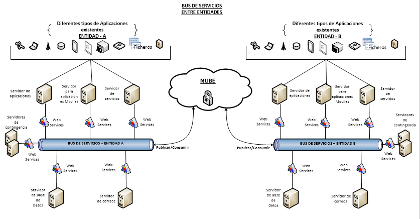

# GUÍA TÉCNICA DE INTEROPERABILIDAD

* Segmento: Interconexión
	* Descripción: Establece las condiciones para que los órganos de gobierno se interconecten, además de fijar las condiciones de interoperación entre el gobierno y la sociedad
* Segmento: Seguridad
	* Descripción: Trata de los aspectos de seguridad de las TIC que el gobierno debe considerar
* Segmento: Medios de Acceso
	* Descripción: Se exponen cuestiones relativas a los estándares de los dispositivos de acceso a los servicios de gobierno electrónico. En esta versión son abordadas, solamente, las políticas y las especificaciones para estaciones de trabajo, tarjetas inteligentes (smartcards), tokens y otras tarjetas. 
* Segmento: Organización e Intercambio de informaciones
	* Descripción: Aborda los aspectos relativos al tratamiento y a la transferencia de informaciones en los servicios de gobierno electrónico. Incluye estándares de estructura de asuntos de gobierno y de metadatos.
* Segmento: Áreas de Integración para Gobierno Electrónico
	* Descripción: Las metas de análisis y proposición de este segmento son:
		* XML Schemas referentes a aplicaciones direccionadas a Áreas de Actuación de Gobierno, que serán organizados en forma de Catálogo, que estarán disponible en un sitio de la web.
		* Componentes relacionados a temas transversales a Áreas de Actuación de Gobierno, cuya estandarización sea relevante para la interoperabilidad de servicios de Gobierno Electrónico, tales como Procesos e Informaciones Geográficas.

Fuente: Estándares y normas de Interoperabilidad e-PING (2014)

## INTERCONEXION

¡### Calidad del servicio de Internet eficiente para las entidades públicas

En la red Internet se desarrolla el gobierno electrónico, por eso este se vuelve un factor clave en la implementación del presente plan. De una muestra de entidades (Formulario de Gobierno Electrónico (DGGE)) del Estado, se pudo verificar respecto al uso de internet que:
* a) El 31% de ellas utilizan el servicio On line con un promedio de velocidad de 5Mbps y de estas solo el 33% tienen redundancia en On line con un promedio de 5 Mbps.
* b) El 72% de ellas tienen conexión xDSL (ADSL, VSDL, etc.) con un promedio de velocidad de 4Mbps y de estas solo el 41% tienen redundancia con un promedio de 4Mbps.
* c) El 8% de ellas tienen conexión 4G LTE, Wimax, Satelital y otros.

De acuerdo a estos datos, se debe mejorar el acceso a Internet en las entidades públicas.

* Lineamiento: Todas las instituciones gubernamentales deberán contar con conexiones redundantes del servicio de internet para tener alta disponibilidad
* Acciones: 
	1. Generar iniciativas que permitan mejorar la calidad de la conexión a internet en las entidades públicas. 
	2. Promover  la sostenibilidad del servicio de internet en las entidades públicas, a través del uso de herramientas (ej. correo electrónico, sitio web)
	3. El ancho de banda requerido por cada institución, deberá ser evaluado de acuerdo al nivel de madurez (nivel de servicios) de gobierno electrónico en el que se encuentre la misma.
* Herramientas: CPE, Ley 164, DS 1793, DS Prontis

### Red interna gubernamental

La red interna gubernamental brinda seguridad para la implementación de aplicaciones del Estado que corren sobre la misma.

* Lineamiento: El Estado deberá crear una red interna gubernamental para interconectar a las entidades publicas
* Acciones:
	1. Implementar la Red Gubernamental, para los servicios de telecomunicación de valor agregado como ser la Telefonía Ip, mensajería, así como también la mejora en el proceso de aplicaciones orientadas a servicios organizacionales de cada entidad. Este programa será implementado en tres fases: inicialmente para el Órgano Ejecutivo, seguidamente los Órganos del Nivel Central y finalmente los Gobierno Autónomos del Estado.
	2. Se deberá utilizar fibra óptica e implementar nuevos tendidos para ampliar la cobertura y así llegar a todos los ministerios del Órgano Ejecutivo inicialmente.
* Herramientas: CPE, Ley 164, DS 1793, DS Prontis

## SEGURIDAD

### Auditorías informáticas en las entidades públicas del estado

Para que las instituciones puedan asegurar que construyan proyectos de tecnología de información que cubran de manera adecuada las necesidades que tiene cada institución, en forma eficiente, oportuna, y dentro del presupuesto contemplado, existe la auditoría informática que apoya a mejorar el control de las Tecnologías de la Información mediante la elaboración de estándares y buenas prácticas.

* Lineamiento: Las entidades públicas, deberán realizar periódicamente auditorías  informáticas externas en base a estándares internacionales
* Acciones
	1. Coordinar el cumplimiento de las auditorias informáticas en las entidades públicas. 
	2. Evaluar los resultados de las auditorias informáticas realizadas a las entidades del Estado.
	* REVISAR LEY SAFCO – NO RECONOCE AUDITORIA DE SISTEMAS
* Herramientas

## AREAS DE INTEGRACIÓN

### Buses de servicio bajo estándares abiertos en entidades públicas.

Para poder transportar información entre las  diferentes entidades públicas, se debe fomentar la implementación de Buses de Servicios, a partir de Servicios Web implementados por las Entidades Pública y que deben estar disponibles en el bus indicado. Los buses actuarán como medio de transporte de datos desde y hacia sistemas estatales. 
A continuación se muestra un esquema general de Bus de Servicios:

* Lineamiento: El Estado promoverá el uso de buses de servicio normalizados y  estandarizados que brinden seguridad  para intercambio de la información
* Acciones:
	1. Capacitar a los responsables de las áreas de sistemas de entidades en el intercambio de información a través de buses de servicio enfatizando la seguridad del mismo.
	2. Realizar seguimiento al intercambio de información según convenio.
* Herramientas
