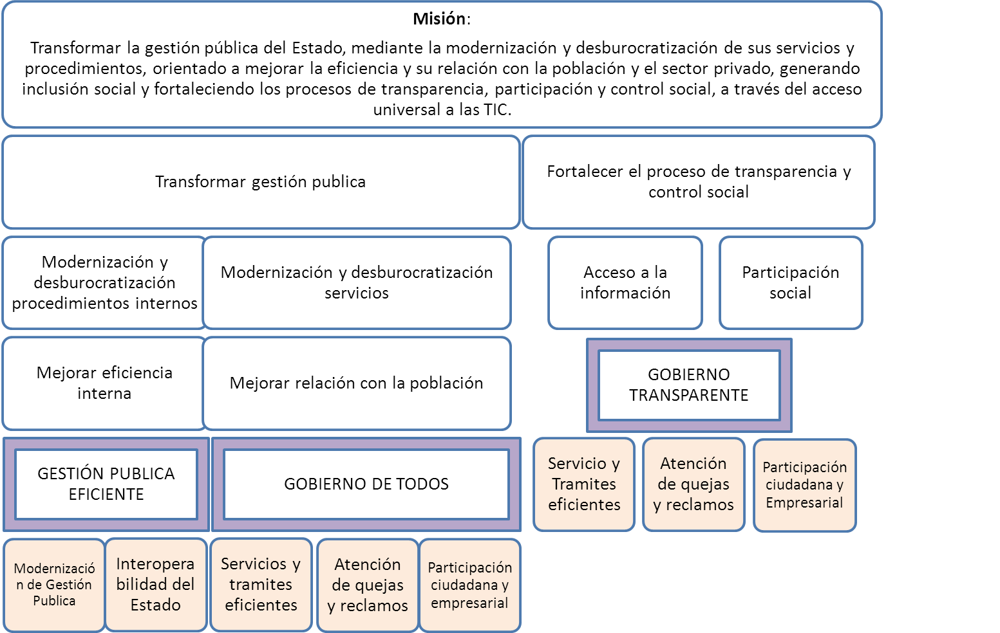

# PARTE III – EJES ESTRATEGICOS

Para la realización de la misión planteada para este plan y asegurar que los beneficios del gobierno electrónico se materialicen para el Estado, la sociedad y el sector privado, este plan concibe tres ejes estratégicos:
* Gobierno Transparente
* Gobierno de Todos
* Gestión Publica Eficiente

Los mismos se desprenden de la Misión planteada para el presente plan de Gobierno Electrónico. En la siguiente grafica se muestra como los Ejes estratégicos se derivan de la Misión. 

Dentro de cada Eje estratégico se cuenta con líneas estratégicas. Los beneficiarios de cada una de estas líneas estratégicas se describen en la siguiente tabla:

Beneficiarios de los Ejes estratégicos

* [Gobierno transparente](partes/gobierno_transparente.md)
* [Gobierno de todos](partes/gobierno_de_todos.md)
* [Gestión pública eficiente](partes/gestion_publica_eficiente.md)
