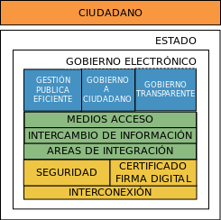
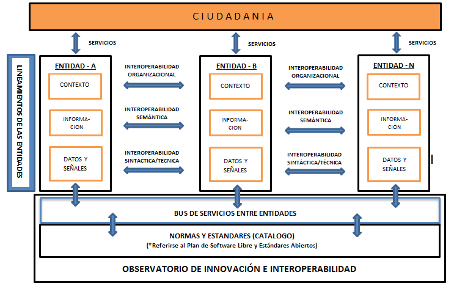

# PARTE IV - ELEMENTOS TECNOLOGICOS TRANSVERSALES

Información de una muestra de entidades del Estado (Formulario de Gobierno Electrónico (DGGE)), dan una pauta de que existe una baja comunicación e interconexión entre los servicios prestados por las diversas instituciones públicas, además de una baja interoperabilidad entre sus sistemas. Esto se debe a que en el Estado no se cuenta con un ente que coordine y defina lineamientos y estándares que impulsen el mejor ejercicio o practica en relación a TIC en el Estado. A esto se suma el hecho de que no se ha priorizado la asignación de recursos destinados a actualizar y modernizar la infraestructura tecnológica y los sistemas del Estado.

Las bases para implementar el Gobierno Electrónico, en cuanto a lo tecnológico, se definen a partir de normas y estándares de interoperabilidad.  La integración de datos, acceso a servicios del Gobierno Electrónico y la administración de contenidos, serán tratados por el Estado Plurinacional de Bolivia de acuerdo a **políticas generales y políticas técnicas**, que se encuentran en el presente documento. Estas serán implementadas de acuerdo a las necesidades de cada entidad.

Los estándares de interoperabilidad están conformados por segmentos  que constituyen el conjunto de normas que viabilizan la conexión y/o de interconexión entre las diferentes Entidades Públicas del Estado Plurinacional de Bolivia. La siguiente tabla muestra la descripción de los segmentos que componen el estándar de e-PING con los ejes estratégicos de Gobierno Electrónico. 

A través de toda la región, se ha avanzado en el desarrollo de planes de conectividad, con diferentes enfoques, tecnologías y objetivos. El objetivo principal es dotar a la población de un mejor servicio de telecomunicaciones. En lo que respecta al servicio de internet, el país está avanzando en mejorar y ampliar la cobertura a través de: extender el tendido de red de fibra óptica, ampliación de la cobertura de internet en áreas rurales a través del satélite por medio de los telecentros, entre varios otros. Todo esto, posibilitará que el Estado en los próximos años cuente con vías modernas de transmisión de datos de alta calidad y eficiencia que brinden una comunicación rápida, económica y fiable entre entidades públicas. No obstante, el país requiere avanzar en la universalización de este servicio a la población que les permita beneficiarse del gobierno electrónico. 

## Mejora en el acceso al servicio de internet

La CPE establece que es responsabilidad del Estado asegurar el acceso a este servicio a la población.

* Líneas de acción: El Gobierno en sus tres niveles, deberá mejorar el acceso al servicio de internet para toda la población para que esta pueda beneficiarse del Gobierno Electrónico
	* Acciones:
		1. Apoyar los esfuerzos del Estado en el tendido de fibra óptica  en las áreas que no tienen cobertura.
		2. Apoyar los esfuerzos del Estado en la instalación de telecentros en el área rural inicialmente con tecnología satelital.
		3. Impulsar la generación de contenidos o servicios de gobierno electrónico que promuevan el uso del internet en todo el país.
	* Herramientas: CPE, Ley 164, DS 1793, DS Prontis

## Adecuada Infraestructura TIC en las entidades públicas 

Con una adecuada Infraestructura tecnológica, se puede asegurar la continuidad y calidad de las operaciones realizadas, la minimización de problemas y la rápida resolución de los mismos, de este modo se puede aprovechar al máximo el uso de las TIC para el funcionamiento de las dependencias y entidades públicas.

* Líneas de acción:
	* Las entidades del Estado deberán reportar el estado de la infraestructura tecnológica con la que cuentan
	* Las entidades del Estado deberán implementar una infraestructura inicial (Se refiere a contar con un centro de datos básico, cableado, arquitectura, refrigeración, redes inalámbricas, etc. ) acorde a sus necesidades
* Acciones:
	* Desarrollar y administrar un inventario de la infraestructura tecnológica de las entidades públicas.
	* Desarrollar una normativa guía que establezcan lineamientos de la adquisición, dotación uso, renovación y baja de equipos de computación adquiridos por el Estado. 
	* Evaluación periódica del estado de la infraestructura tecnológica de las entidades públicas, con la finalidad de proponer mejoras, cambios y ajustes. 
	* Evaluar la mejora de sus centros de cómputo,  en cumplimiento a la normativa 1793. Sugerencia de Marco Arce
	* Tambien capacitar y evaluar al RRHH (javier)
* Herramientas: CPE, Ley 164, DS 1793, DS Prontis

## Centro de Procesamiento de Datos Estatal bajo plataforma Cloud Computing para entidades estatales

(Recomendaciones que en un futuro pueda manejar Big Data)

El Centro de Procesamiento  de Datos Estatal (CPDE) (explicar el porque) concentrará los distintos centros de datos y los servicios de las  entidades públicas con el fin de tener toda la información y los sistemas estatales centralizados en una sola infraestructura tecnológica. Esto permite tener beneficios tecnológicos y económicos. Este CPDE también ofrecerá un portafolio modelo de distribución tecnológica que se conoce como Cloud Computing o Nube para los que lo requieran, el cual permitirá a las entidades enfocarse en el core de su institución y dejar a los administradores del CPDE los aspectos relacionados con la administración y escalabilidad de la infraestructura tecnológica, logrando mecanismos de ahorro en costos cuantificables a la vez que incrementarán la agilidad, escalabilidad y seguridad.

* Líneas de acción: El Estado deberá implementar un Centro de Procesamiento de Datos Estatal para entidades públicas
* Acciones
	1. Realizar un análisis de la tecnología con la que cuenta cada centro de datos en las distintas instituciones, con el fin de identificar los componentes necesarios para la interoperabilidad en este sistema Hibrido.
	2. Realizar un estudio económico que permita identificar los beneficios económicos de contar con esta infraestructura. 
	3. Desarrollar un Centro de Procesamiento de Datos Estatal (CPDE) que pueda alojar la réplica de los Centros de Datos de algunas instituciones y también deberá ofrecer servicios de Cloud Computing para las instituciones que así lo requieran.
* Herramientas: CPE, Ley 164, DS 1793, DS Prontis

La seguridad informática es de gran importancia en las entidades del Estado, debido a las amenazas informáticas (intrusos o programas maliciosos) que representan un problema serio que merece tener atención especial para evitar efectos negativos referente a la información confidencial de la entidad del Estado. 

## Uso de certificado y firma digital garantizando la identidad del emisor, la confidencialidad y la integridad del contenido.

Actualmente se cuenta con normativa para la implementación de la firma y certificado digital.  Corresponde al Estado el promover y difundir estas herramientas tecnológicas en la sociedad, sector público y privado.

* Líneas de acción: El Estado deberá fomentar, promover y difundir el uso del certificado y la firma digital, como herramienta para optimizar los servicios técnicos, financieros y administrativos
* Acciones:
	* Desarrollar mecanismos y estrategias de promoción y uso de la firma y certificado digital tanto para el sector público como privado.
	* EN EL MARCO DEL REGLAMENTO PARA EL DESARROLLO DE LAS TIC
* Herramientas: CPE, Ley 164, DS 1793, DS Prontis

De acuerdo al análisis de la encuesta de Gobierno Electrónico, se pudo constatar que de una muestra de aplicaciones desarrolladas en las entidades públicas, 46% son aplicaciones web y basadas en Software Libre. Esto significa que aproximadamente la mitad son aplicaciones que emplean un navegador como medio de acceso a las fuentes de información del Estado.

## Buenas prácticas de seguridad, normas y estándares internacionales

La aplicación de estándares de buenas prácticas internacionales de seguridad protegen de amenazas externas e internas a los sistemas de entidades del Estado.

* Lineamiento: Las entidades públicas aplicarán estándares y buenas prácticas internacionales de seguridad
* Acciones:
	1. Normar a las instituciones gubernamentales el uso de normas internacionales de seguridad con controles y procedimientos adecuados para asegurar el tratamiento seguro de los datos y la información. 
	2. Normar el uso de correos electrónicos institucionales en todas las instituciones gubernamentales.
* Herramientas: 

## Estudio de servicios y trámites para medir el intercambio de información entre entidades (Idea).

Explicación de lineamiento

* Líneamiento: El estado deberá elaborar un estudio de servicios y trámites que incluya el análisis de documentos digitalizados para la elaboración de un plan de digitalización de la información.
* Acciones:
	* El estado debe coordinar el Estudio de trámites y servicios
	* Las entidades deben elaborar un Plan de digitalización 
	* Las entidades deben publicar la información que ya esta digitalizada
* Herramientas: CPE, Ley 164, DS 1793

Explicación de lineamiento

* Líneamiento: El estado deberá promover consensos entre entidades sobre interoperabilidad
* Acciones
	* Promover espacios de discusión entre entidades para proponer resoluciones sobre temas técnicos legales y otros relacionados a la interoperabilidad
	* Elaboración de normas legales a partir de resoluciones consensuadas entre entidades
* Herramientas: CPE, Ley 164, DS 1793

## Uso del navegador web como principal medio de acceso a la información

Es sumamente importante estandarizar el medio de acceso a todas las fuentes de información del Estado Plurinacional de Bolivia, en este caso el uso del navegador como principal medio de acceso cuando se utiliza la Internet y una estación de trabajo. Para los dispositivos móviles se pueden emplear otro tipo interfaces además de los navegadores. Se debe incluir también actualmente para el acceso a la información los televisores inteligentes, pues integran la Internet y las características de la Web 2.0 a la televisión digital.

* Lineamiento: Las entidades del Estado deberán hacer uso del navegador web como medio de acceso principal a la información del Estado
* Acciones
	1. Las entidades del Estado deberán migrar las aplicaciones cliente servidor actuales a aplicaciones web con Software Libre
	2. Las entidades públicas deberán realizar sus nuevos desarrollos orientados a la web y en formato de software libre. 
	3. Diseñar interfaces de usuario final adecuadas a varios dispositivos de acceso, como ser, dispositivos móviles.
* Herramientas: Ley 164, DS 1793

## Simplificación de procesos administrativos en la migración de sistemas de información

El sistema de información a ser migrado deberá adecuarse a las actuales necesidades de información de la entidad del Estado. Mejora o simplificación de procesos deben ser tomados en cuenta en la nueva aplicación. Es decir, a la vez que se vaya a migrar una aplicación, se deberán incorporar mecanismos de simplificación de procesos administrativos de las aplicaciones candidatas a migración. 

* Lineamiento: En los procesos de migración a Software Libre y a aplicaciones web, las entidades del Estado deberán aprovechar estas para la simplificación de sus procesos administrativos. 
* Acciones: Las entidades del Estado deberán analizar y simplificar los procesos administrativos  antes de ejecutar la migración de sus sistemas a Software Libre y a aplicaciones web.
* Herramientas: Ley 164, DS 1793

## Uso de Administradores de Procesos de Negocios (BPM)

El uso de herramienta de automatización de Administración de Procesos de Negocio es importante pues la misma nos brinda la flexibilidad necesaria para afrontar cambios inmediatos en los procesos administrativos, además de confiabilidad y robustez en los mismos. Esta herramienta se puede aplicar en trámites generales de las entidades.

* Lineamiento: Las entidades del Estado deberán priorizar el uso de herramientas de automatización de Procesos de Negocios (BPM) para sus procedimientos.
* Acciones: Las entidades del Estado deberán analizar y evaluar cuáles son sus procesos internos que pueden ser sujetos de ser llevados a aplicaciones BPM.
* Herramientas: Ley 164, DS 1793

De acuerdo al análisis de la encuesta de Gobierno Electrónico, se pudo constatar que de una muestra de aplicaciones desarrolladas en las entidades públicas, 28% de las entidades del estado brindan algún tipo de servicio basado en TIC a la población y 32% de las mismas interactúan con otras entidades del Estado empleando TIC. Esto significa que se debe mejorar el grado de interoperabilidad entre las Entidades del Estado y el ciudadano y entre las entidades mismas del Estado. De este modo se deben generar mecanismos para que la integración e intercambio de información mediante el uso de Estándares Abiertos.

## Promoción y mejora del Intercambio de Información basados en Estándares Abiertos

Se debe tratar la forma de intercambio de datos entre los sistemas de información de las diferentes entidades del Estado.

* Lineamiento: Las entidades deberán adoptar políticas técnicas de intercambio de información  conforme a estándares abiertos.
	* Acciones: Orientar, capacitar a servidores públicos sobre el uso de estándares abiertos.
	* Herramientas: Convenios y catálogos de interoperabilidad
* Lineamiento: El estado deberá crear mecanismos de integración de búsqueda entre todos los sitios web del Estado.
	* Acciones:
		1. El Estado creará una base de datos de manera distribuida que facilité la búsqueda y acceso de información en todas las páginas web de entidades públicas.
		2. El Estado pondrá a disposición información pública brindada por una estructura de metadatos para la descripción y búsqueda de recursos en la web para describir los recursos electrónicos, recursos no electrónicos y servicios disponibles en la web.
	* Herramientas:
		* Creación de herramientas de búsqueda integrada
		* Creación de estructura de metadatos

La arquitectura de interoperabilidad será administrada por el Estado, dado su carácter dinámico, precautelando la interacción de información con una perspectiva sostenible y de gestión a largo plazo. Las políticas técnicas mencionadas previamente son prerrequisito para abordar la presente sección. La siguiente gráfica muestra la Arquitectura Orientada a Servicios de interoperabilidad (Arquitectura Orientada a Servicios (Service Oriented Architecture/SOA). Es un modelo de arquitectura para diseñar y desarrollar sistemas distribuidos. Las soluciones  SOA  han sido creadas para satisfacer los objetivos de acción de las Entidades, las cuales ofrecen facilidad y flexibilidad de integración con sistemas legados, alineación directa de los procesos de acción entre Entidades y reduciendo costos de implementación, innovación de servicios y una adaptación ágil y reacción temprana ante cambios que se pueden presentar.). La arquitectura SOA permite la creación de sistemas de información altamente escalables que reflejarán las acciones de las entidades entre si y a su vez brindarán una forma definida de publicar y consumir los servicios web, aspecto que facilita la interacción e intercambio de información entre diferentes sistemas propios de las Entidades Públicas o de terceros.

## Arquitectura transversal orientada a los servicios de intercambio de información

La Arquitectura Referencial servirá como modelo base para la implementación de las plataformas SOA en las entidades públicas.

* Lineamiento: El Estado pondrá a disposición una Arquitectura Referencial basada en plataforma SOA para el intercambio de información bajo estándares abiertos.
* Acciones:
	1. Diagnosticar la situación actual de todas las plataformas existentes en las Entidades Públicas.
	2. Impulsar a las entidades a adoptar y adaptar la Arquitectura Referencial. 
	3. Impulsar a las entidades a implementar plataformas SOA propias.
* Herramientas:
	* Ley 164, DS 1793.
	* Se requiere normativa que establezca la obligatoriedad de implementación  de la arquitectura y plataformas SOA.

## Catálogo de interoperabilidad o de Servicios Web

La adopción del XML y el desarrollo de XML Schemas como fundamentos para la integración e interoperabilidad electrónica del gobierno lleva a la necesidad de crear un “Catalogo de esquemas” bajo responsabilidad del mismo gobierno. El Catálogo tiene por objetivo establecer estándares de XML Schemas que se aplican a las interfaces de sistemas que apoyen a “Oferta de Servicios de Gobierno Electrónico”. El catálogo será administrado por el Estado siendo éste responsable de los procesos de cambio y  difusión. 

* Lineamiento: El estado deberá implementar mecanismos para el intercambio de información entre las entidades públicas.
* Acciones:
	* El Estado elaborará e integrará y administrará en un catálogo de interoperabilidad los servicios web de las entidades públicas.
	* Impulsar el desarrollo de propuestas de inserción de servicios web de cada entidad pública. 
	* Analizar, aprobar y  reformular la incorporación de los servicios web propuestos al catálogo. 
	* Publicar y difundir los servicios web incorporados al catálogo a través del Portal del Estado y por medios impresos.
* Herramientas
	* Ley 164, DS 1793.
	* Se requiere normativa que establezca la obligatoriedad de implementación  de la arquitectura y plataformas SOA.
