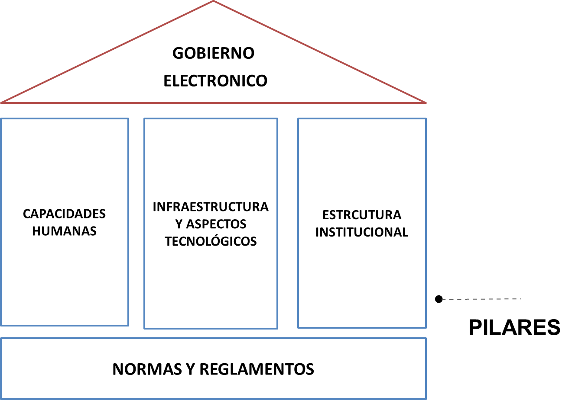

# PILARES DEL GOBIERNO ELECTRÓNICO

A continuación se presenta el modelo de gestión que garantizará que el Estado, en sus diferentes órganos y niveles, pueda efectivamente poner en marcha el desarrollo de herramientas de Gobierno Electrónico. Este está compuesto por cuatro pilares sobre los que se fundará el Gobierno electrónico.

* [A. Estructura institucional](partes/estructura_institucional.md)
* [B. Infraestructura y tecnología](partes/infraestructura_y_tecnologia.md)
* [C. Normas y reglamentos](partes/normas_y_reglamentos.md)
* [D. Capacidad en talento humano](partes/capacidad_en_talento_humano.md)
